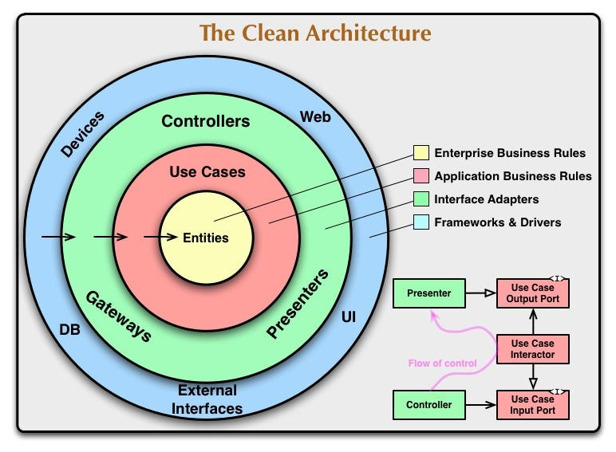
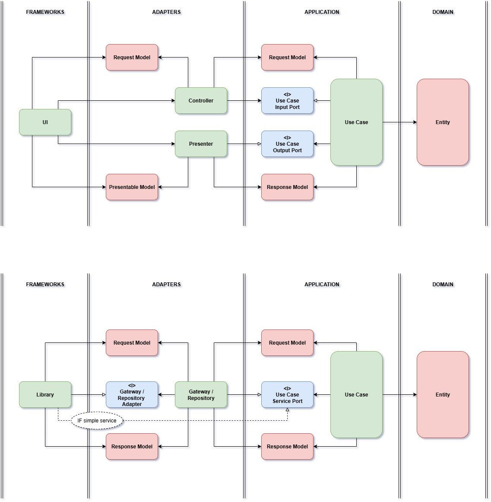
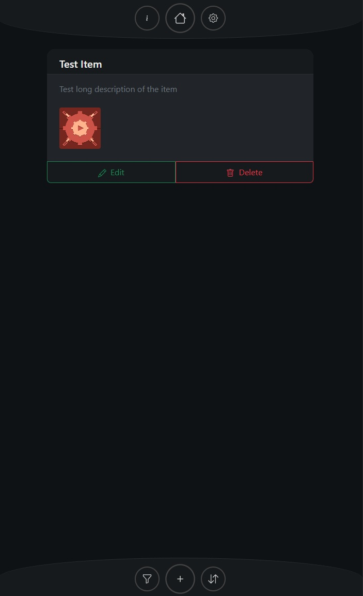

# Clean Architecture WebApp

This project is a **blueprint and showcase** demonstrating how to apply **Clean Architecture** principles in a modern web application using **React** and **Firebase**.  
It highlights the benefits of strict layer separation, testability, scalability, and long-term maintainability through a practical and working example.

---

## 🛠️ Tech Stack

| Tool / Library         | Role                                      |
|------------------------|-------------------------------------------|
| **TypeScript**         | Type-safe language for maintainability    |
| **React**              | UI library with component-based structure |
| **Vite**               | Dev server and modern bundler             |
| **Bootstrap**          | UI styling and responsive layout          |
| **Firebase Auth**      | Authentication and user management        |
| **Firebase Firestore** | NoSQL database for item persistence       |
| **Firebase Hosting**   | Hosting service                           |

---

## 🧭 Architecture

This project follows **Clean Architecture** as illustrated below:

### High-Level Structure



### Detailed Flow



- **Frameworks**: React components, Firebase SDK, and cache layers
- **Adapters**: Controllers, Presenters, and Repositories
- **Application**: Business logic through Use Cases and Services
- **Domain**: Core entities and rules

---

## 📁 Project Structure

```

├── adapters
│   ├── controllers          # Input ports (UI to use case)
│   ├── presenters           # Output ports (use case to UI)
│   └── gateways/repositories
│       ├── files            # File repository interfaces + DTOs
│       └── items            # Item repository interfaces + DTOs
│
├── application
│   ├── services             # Support services (e.g. auth, router)
│   └── usecases             # Core application logic
│       ├── auth             # Sign in/out
│       └── items            # CRUD use cases
│
├── domain
│   └── entities             # Business entities (Item, File, User)
│
├── frameworks
│   ├── cache                # Multi-level caching system
│   ├── firebase             # Firebase-specific implementations
│   └── react                # React app entrypoint, pages, components
│
├── dependencies             # Dependency injection setup
└── utils                    # Shared utilities

````

---

## 🖼️ UI Preview



---

## ✅ Features

The application follows Clean Architecture principles, ensuring a clear separation of concerns across different layers. 

Firebase is used for both authentication and data persistence, providing a reliable and scalable backend. 

A multi-level caching system is implemented to optimize performance and minimize Firestore access. 

The UI is built with reusable item components, promoting consistency and easier maintenance. 

The interface is fully responsive and designed with a modern dark theme, making it suitable for both desktop and mobile use.

---

## 🔥 Setup Firebase

In the Firebase Console (https://console.firebase.google.com/):

1. Go to **Project Settings > General**.
2. Scroll to **Your apps**.
3. Click **\</> (Web)** to register a new web app if you haven't already.
4. Set a nickname for your app and click **Register app**.
5. You'll get the config object containing keys like `apiKey`, `authDomain`, etc.
6. Save these values for the next steps.

## 📦 Setup Project

1. Clone the repository and install dependencies:

    ```bash
    git clone https://github.com/AlessandroDeFrancesco/CleanArchitectureWebApp.git
    cd webapp-clean-architecture
    npm install
    ````

2. Install Firebase tools and prepare the project:

    ```bash
    npm install -g firebase-tools
    firebase login
    firebase init
    ```
    When init is launched:
    - Select these services: `auth, firestore, hosting, emulators`
    - Select the project configured in `🔥Setup Firebase`
    - Use `dist` for the deploy
    - Use the default ports for the emulators and install these emulators: `auth, firestore`

3. Create a `.env` file in the root folder with the following content taken from step `🔥Setup Firebase`:

    ```
    VITE_FIREBASE_API_KEY=AIzaSyA...your_api_key
    VITE_FIREBASE_AUTH_DOMAIN=your-project.firebaseapp.com
    VITE_FIREBASE_PROJECT_ID=your-project-id
    VITE_FIREBASE_STORAGE_BUCKET=your-project.appspot.com
    VITE_FIREBASE_MESSAGING_SENDER_ID=123456789012
    VITE_FIREBASE_APP_ID=1:123456789012:web:abcdef123456
    VITE_FIREBASE_MEASUREMENT_ID=G-XXXXXXXXXX
    ```

---

## 🛠️ Development

To start the development server with firebase completely emulated in local:

```bash
npm run dev
```
The webapp will be hosted at:  http://localhost:5173/

Add at least one user to Firebase Auth to be able to authenticate in the webapp: http://127.0.0.1:4000/auth

Manage Firebase Firestore: http://127.0.0.1:4000/firestore

## 📝 Tests

Run the tests

```bash
npm run test
```

To add more tests, create them in `src\tests\`.

e.g.: `src\tests\NewTest.test.ts`

## ⬆️ Deploy

Deploy the webapp on Firebase Hosting

```bash
npm run build
firebase deploy
```

---

## ⚠️ Disclaimers

### Firestore Usage Limitations

> **Important:** This project uses Firebase Firestore directly from the client. While convenient, this approach is only suitable for **personal projects**, **prototypes**, or **applications with trusted users**.

Firestore security rules **cannot enforce complex logic**, rate limits, or hard document quotas. Any user with write access can technically:

* Bypass client-side checks
* Spam document creation
* Exhaust your Firestore quota

Firestore Rules are not designed to handle:

* Global document counting (`count()`)
* Rate limiting
* Other business logic (e.g., "only allow 10 files per item")

For **production-grade applications**, a proper backend should be used (e.g., with **Cloud Functions**, **Express.js**, or another server) to:

* Enforce logic safely
* Control write limits and quotas
* Validate and sanitize incoming data

**Do not rely on client-only Firestore for any application where data integrity, cost control, or abuse prevention is important.**
Use a real backend when you need proper control.

---

### Firestore Files Usage

> **Important:** **User files are stored directly in Firestore documents** (as base64-encoded strings) instead of using Firebase Storage.
This decision is made **purely for convenience** and to keep the project self-contained and easy to clone, run, and understand.

This approach is **not suitable for real applications**:

* Firestore has **strict limits** on document size (1MB max), making it impractical for anything beyond very small files.
* Storing binary data as base64 **increases storage size** and **slows down performance**.
* There's **no streaming**, no resumable uploads, and no native file handling support.

In production, user-uploaded files should be handled via **Firebase Storage**, **another object storage service**, or a **custom backend**, with Firestore used only for metadata references (e.g., file name, size, storage path, etc.).

---

## 📃 License

This project is licensed under the MIT License. See the LICENSE file for details.

